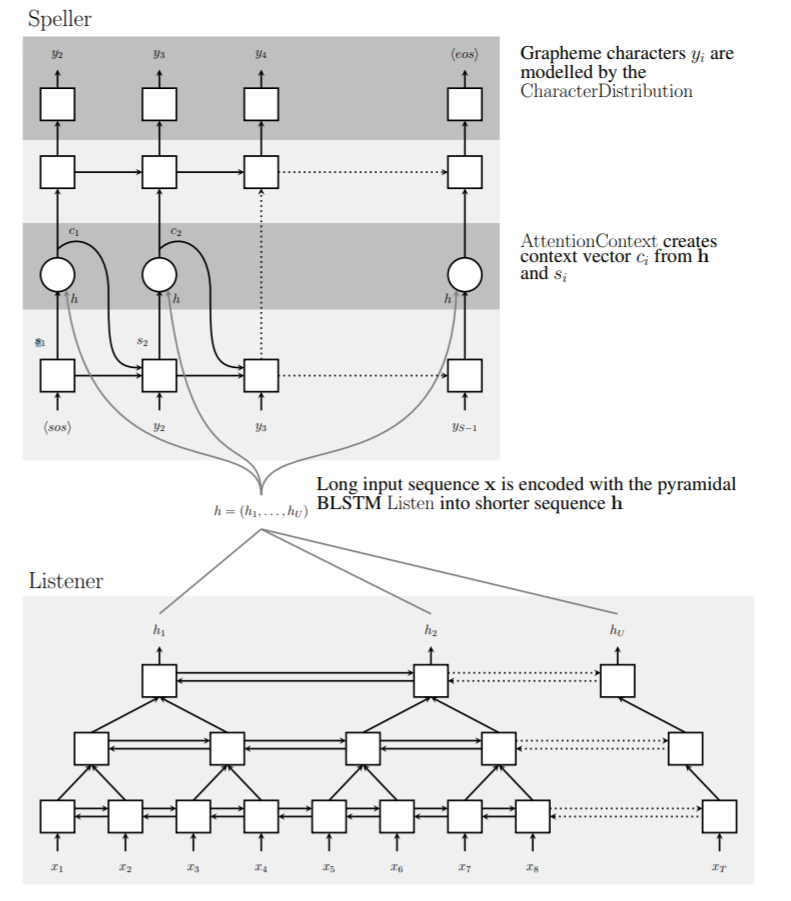
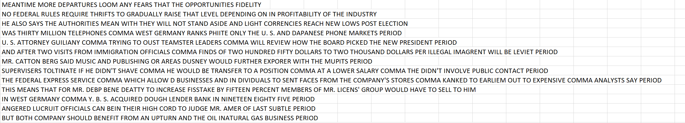

# Speech_to_Text
Sequence-to-Sequence modelling using Attention-Based LSTM architecture

1. Project Motivation
2. Approach
3. Results
4. Future Scope of Improvements
5. Licensing, Authors, and Acknowledgements

# Project Motivation
The main objective of this project was to build an end-to-end system to transcribe a given speech utterance, basically speech-to-text transcription. This appraoch can be used in multiple applications such as subtitles generation, transcription generation and can be extended to a machine translation model, image captioning etc.

# Approach

The approach was based on the widely popular research paper called ‘[Listen, Attend and Spell](https://arxiv.org/abs/1508.01211)’. 

Famous WSJ dataset containing raw mel-spectrogram frames of utterances was used as the input. The corresponding output was the actual text decoded from the utterances. 

It is an encoder-decoder approach with Attention mechanism. The encoder consists of a pyramidal Bi-LSTM network that takes in the given utterances and compresses it to produce high-level representations for the Decoder network. The Decoder network takes these high-level representations from the encoder and uses it to compute a probability distribution over sequences of characters using the attention mechanism. Proposed a semi-supervised training for reducing overfitting. Masking was used in the loss and attention mechanism for tackling the variable input sizes.

For more details, please refer the paper linked above. 

In order to improve the result from the baseline, following variations were implemented:
 - In the encoder network, I used a CNN layer to extract useful features from the raw spectrogram input
 - Proposed a semi-supervisied learning approach in the decoder to reduce overfitting, also know as Teacher Forcing.
 - Added Gumbel noise to the character embeddings in the decoder
 
# Results:

This is a character-based prediction. I achieved a Perplexity score under 1.1 for each character prediction. The project was evaluated on edit distance aka Levenshtein distance. Achieved an 10 Levenshtein distance. 

The sample output is as follows:

# Future work
- I have used a greedy approach to select the most probable character. In order to improve results, Beam search algorithm can be used to keep the top B sequences.
- DropConnect type of dropout can be used in the encoder to reduce overfitting, if necessary. 

# Licensing, Authors, and Acknowledge
The data is available on WSJ website. The work done is private and cannot be shared with anyone. The workbook here are only for exploration and cannot be used for any other reasons. 
